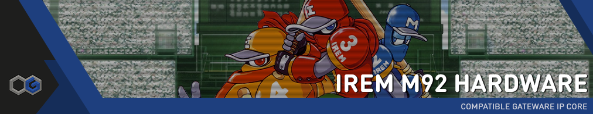

[](#status-of-features)
[](https://github.com/opengateware/arcade-irem_m92/actions/workflows/build.yml)
[](https://github.com/opengateware/arcade-irem_m92/releases)
[](#legal-notices)
[](https://github.com/opengateware/arcade-irem_m92/issues)
[](https://github.com/opengateware/arcade-irem_m92/stargazers)
[](https://chat.raetro.org)
[](https://twitter.com/marcusjordan)

# Irem M92 Compatible Gateware IP Core

> This Implementation of a compatible Irem M92 arcade hardware in HDL is the work of [Martin Donlon].

## Overview

Launched by Irem in 1991, the M92 was an advanced arcade system that offered robust graphics and sound capabilities.

The M92 system was known for its cutting-edge graphical and sound technologies that enhanced the arcade gaming experience, paving the way for future innovations in the industry. The diverse array of games it supported showcased the hardware's capabilities, making it a popular choice for arcade operators and a fond memory for gamers.

Notable Games:

- R-Type Leo: Horizontally-scrolling shoot-em-up and is the third and final arcade release of this classic series.
- GunForce: Run-and-gun shooter where players battle against an army of robots and machines to save the world.
- Blade Master: Side-scrolling fantasy action game featuring two warriors battling through various mythological creatures.
- Undercover Cops: Beat 'em up game set in a future where players fight against urban decay and crime.
- In the Hunt: A submarine-based shoot 'em up with detailed, rich graphics depicting underwater environments.
- Ninja Baseball Bat Man: Side-scrolling beat-em-up for in which up to four players control a team of robotic baseball-star ninjas who must fight their way through a variety of levels, defeating the game's many enemies.

## Technical specifications

- **Main CPU:**     NEC V33 @ 9 MHz
- **Sound CPU:**    NEC V35 @ 14.318181 MHz
- **Sound Chip:**   YM2151 OPM @ 3.579545 MHz
- **Sound Chip:**   Irem GA20 @ 3.579545 MHz
- **Resolution:**   320×240 @ 6.666 MHz, 32,768 colors (15 bits)
- **Aspect Ratio:** 4:3
- **Orientation:**  Horizontal/Vertical
- **Players:**      Up to 4 players (solo, 2-4 concurrents)
- **Control:**      8-way joystick
- **Buttons:**      6

## Compatible Platforms

- Analogue Pocket

## Compatible Games

> **Notice Regarding ROMs:** This repository does not contain any ROMs or game files, nor will any links or pre-assembled ROMs be provided by OpenGateware in any form. Users must ensure they have the legal authority to use these titles in their jurisdiction. By using this core, you agree to supply your own ROMs. We do not condone or support the unauthorized use or distribution of copyrighted or any other intellectual property-protected materials.

| **Game**                                              | Status |
| :---------------------------------------------------- | :----: |
| Blade Master (World)                                  |   ✅   |
| Dream Soccer '94 (Japan, M92 hardware)                |   ✅   |
| Gun Force II (US)                                     |   ✅   |
| Gunforce - Battle Fire Engulfed Terror Island (World) |   ✅   |
| Hook (World)                                          |   ✅   |
| In The Hunt (World)                                   |   ✅   |
| Lethal Thunder (World)                                |   ✅   |
| Major Title 2 (World, Set 1)                          |   ✅   |
| Mystic Riders (World)                                 |   ✅   |
| Ninja Baseball Bat Man (World)                        |   ✅   |
| R-Type Leo (World)                                    |   ✅   |
| Superior Soldiers (US)                                |   ✅   |
| Undercover Cops (World)                               |   ✅   |
| Undercover Cops - Alpha Renewal Version (World)       |   ✅   |

### ROM Instructions

<details>
  <summary>Click to expand</summary>

1. Download and Install [ORCA](https://github.com/opengateware/tools-orca/releases/latest) (Open ROM Conversion Assistant)
2. Download the [ROM Recipes](https://github.com/opengateware/arcade-irem_m92/releases/latest) and extract to your computer.
3. Copy the required MAME `.zip` file(s) into the `roms` folder.
4. Inside the `tools` folder execute the script related to your system.
   1. **Windows:** right click `make_roms.ps1` and select `Run with Powershell`.
   2. **Linux and MacOS:** run script `make_roms.sh`.
5. After the conversion is completed, copy the `Assets` folder to the Root of your SD Card.
6. **Optional:** an `.md5` file is included to verify if the hash of the ROMs are valid. (eg: `md5sum -c checklist.md5`)

> **Note:** Make sure your `.rom` files are in the `Assets/irem_m92/common` directory.
</details>

## Status of Features

> **WARNING**: This repository is in active development. There are no guarantees about stability. Breaking changes might occur until a stable `1.0` release is made and announced.

- [ ] NVRAM/HiScore Save

## Credits and acknowledgment

- [Martin Donlon]
- [Jose Tejada]
- [Gyorgy Szombathelyi]

## Support

Please consider showing your support for this and future projects by contributing to the developers. While it isn't necessary, it's greatly appreciated.

- OpenGateware: [Marcus Andrade](https://ko-fi.com/boogermann)

## Powered by Open-Source Software

This project borrowed and use code from several other projects. A great thanks to their efforts!

| Modules                    | Copyright/Developer     |
| :------------------------- | :---------------------- |
| [Irem M92 RTL]             | 2023 (c) Martin Donlon  |
| [V30]                      | 2021 (c) Robert Peip    |
| [JT51]                     | 2017 (c) Jose Tejada    |

## License

This work is licensed under multiple licenses.

- All original source code is licensed under [GNU General Public License v3.0 or later] unless implicit indicated.
- All documentation is licensed under [Creative Commons Attribution Share Alike 4.0 International] Public License.
- Some configuration and data files are licensed under [Creative Commons Zero v1.0 Universal].

Open Gateware and any contributors reserve all others rights, whether under their respective copyrights, patents, or trademarks, whether by implication, estoppel or otherwise.

Individual files may contain the following SPDX license tags as a shorthand for the above copyright and warranty notices:

```text
SPDX-License-Identifier: GPL-3.0-or-later
SPDX-License-Identifier: CC-BY-SA-4.0
SPDX-License-Identifier: CC0-1.0
```

This eases machine processing of licensing information based on the SPDX License Identifiers that are available at <https://spdx.org/licenses/>.

## Legal Notices

- Blade Master / Cross Blades!                      (c) 1991 Irem Corp.         All rights reserved.
- Dream Soccer 94                                   (c) 1994 Irem Corp.         All rights reserved.
- Gunforce                                          (c) 1991 Irem Corp.         All rights reserved.
- Gunforce 2 / Geostorm                             (c) 1994 Irem Corp.         All rights reserved.
- Hook                                              (c) 1992 Irem Corp.         All rights reserved.
- In The Hunt / Kaitei Daisensou                    (c) 1993 Irem Corp.         All rights reserved.
- Lethal Thunder / Thunder Blaster                  (c) 1991 Irem Corp.         All rights reserved.
- Major Title 2 / The Irem Skins Game               (c) 1992 Irem Corp.         All rights reserved.
- Mystic Riders / Mahou Keibitai Gun Hohki          (c) 1992 Irem Corp.         All rights reserved.
- Ninja Baseball Batman / Yakyuu Kakutou League-Man (c) 1993 Irem America Corp. All rights reserved.
- Perfect Soldiers / Superior Soldiers              (c) 1993 Irem Corp.         All rights reserved.
- R-Type Leo (Japan)                                (c) 1992 Irem Corp.         All rights reserved.
- Undercover Cops                                   (c) 1992 Irem Corp.         All rights reserved.

The Open Gateware authors and contributors or any of its maintainers are in no way associated with or endorsed by IREM SOFTWARE ENGINEERING INC® or any other company not implicit indicated.
All other brands or product names are the property of their respective holders.

[Irem M92 RTL]: https://github.com/MiSTer-devel/Arcade-IremM92_MiSTer/tree/main/rtl
[JT51]: https://github.com/jotego/jt51
[V30]: https://github.com/RobertPeip
[Martin Donlon]: https://github.com/wickerwaka
[Gyorgy Szombathelyi]: https://github.com/gyurco
[Jose Tejada]: https://github.com/jotego

[GNU General Public License v3.0 or later]: https://spdx.org/licenses/GPL-3.0-or-later.html
[Creative Commons Attribution Share Alike 4.0 International]: https://spdx.org/licenses/CC-BY-SA-4.0.html
[Creative Commons Zero v1.0 Universal]: https://spdx.org/licenses/CC0-1.0.html
